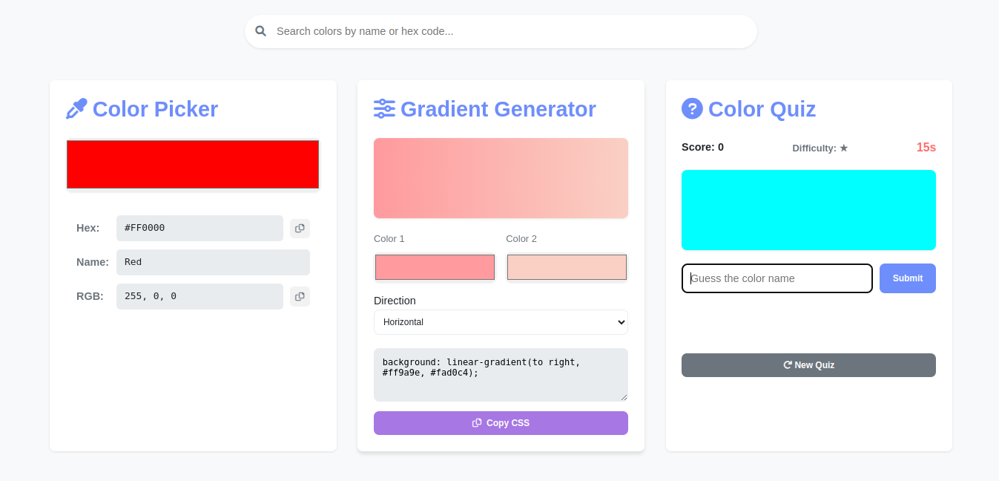
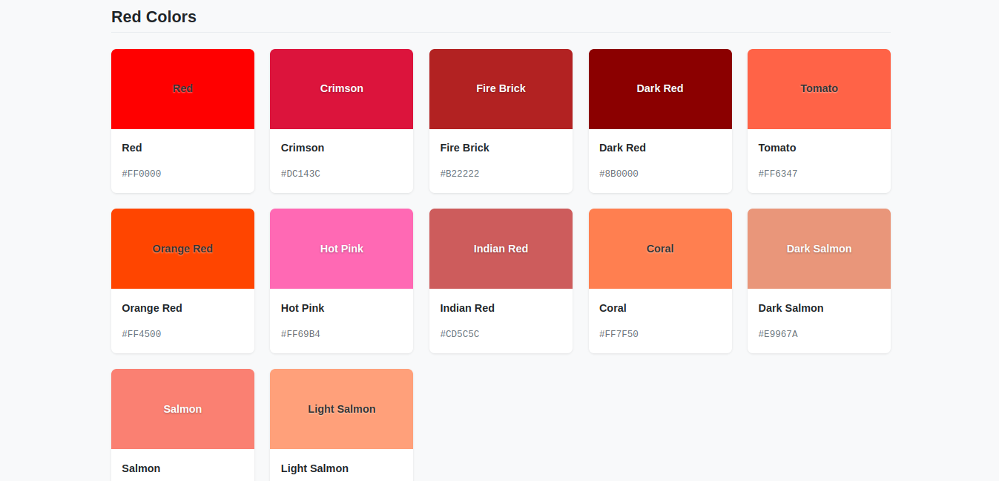
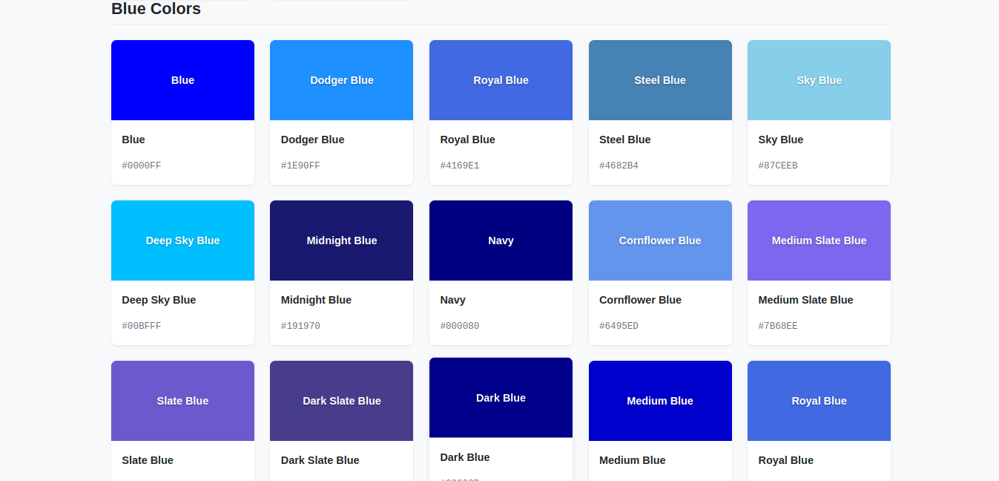

# Hexpert - Color Mastery Tool 🎨

A lightweight web application for exploring, creating, and testing color knowledge - built with pure HTML, CSS, and JavaScript.

## ✨ Features

### 🎨 Color Tools

- **200+ Named Colors** with HEX codes
- **Interactive Color Picker** with real-time HEX/RGB conversion
- **Gradient Generator** with customizable direction and CSS output
- **Smart Quiz System** with 3 difficulty levels

### 🎮 Color Quiz

- **Level 1**: Basic colors (Red, Blue, Green, etc.)
- **Level 2**: Intermediate colors (Orchid, Coral, etc.)
- **Level 3**: Advanced colors (Lavender, Peru, etc.)
- **Adaptive Difficulty**: Automatically adjusts based on performance
- **30-second Timer** per question

## 🚀 How to Use

1. **Color Picker**:
   - Select any color to view its name and values
   - Copy HEX/RGB codes with one click

2. **Gradient Generator**:
   - Choose two colors and direction
   - Get ready-to-use CSS code

3. **Color Quiz**:
   - Guess the color name from the swatch
   - Earn points for correct answers
   - Difficulty increases after 3 correct answers

## 🌈 Color Database Highlights

- **15 Basic Colors** (Red, Blue, Yellow, etc.)
- **20 Intermediate Colors** (Orchid, Coral, Gold, etc.)
- **15 Advanced Colors** (Lavender, Peru, Khaki, etc.)
- **Custom Color Support**: Names any picked color

## 🛠️ Built With

- Pure HTML5, CSS3, JavaScript (No frameworks)
- CSS Variables for theming
- Flexbox/Grid for layout
- Font Awesome icons

## 📜 License

MIT License - Free for personal and commercial use

*Developed with ❤️ by Sharan Vasoya*
